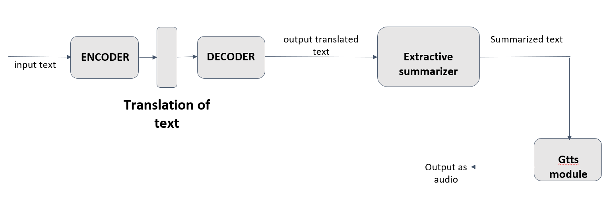

# Neural Machine Translator & Summarizer

This project aims to build a News
Translator and Summarizer using Neural
Machine Translations which uses a sequence to
sequence model which works on the encoder
decoder architecture to translate news articles
from Hindi to English.TF-IDF is used to
summarize the translated text which makes
it convenient for the reader to skim through
articles.Further we have used gTTs a python
library to convert the summarized text into
Speech. Results obtained by the extractive
summarizer were up to the mark and that of the
machine translator can use more improvement.


## Literature Survey 
We have based our project from insights gained after research on several prior works. We have mentioned a few journals along with their detailed methodology [here](literature_survey.pptx)

## Project Report
For the complete understanding of our project along with its scope and motivation please find our project report attached [here](project_report.pdf)


## Initial setup

We have built the NMT and Text summarizer on Jupyter notebooks,

Here are the libraries we have used

1) To install pyTorch
```bash
  pip install torch
```
2) To install newspaper3k library to get news articles online:
```bash
  pip install newspaper3k
```
3) To install Text to Speech translator
```bash
  pip install gTTs
```
4) To install spacy, a library for advanced Natural Language Processing
```bash
  pip install spacy
```
5) To install matplotlib for graphical interpretation
```bash
  pip install matplotlib
```
## High Level Design




## Code

Complete code of the project along with the datasets can be found [here](CODE/)


